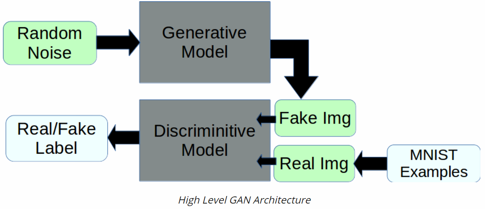
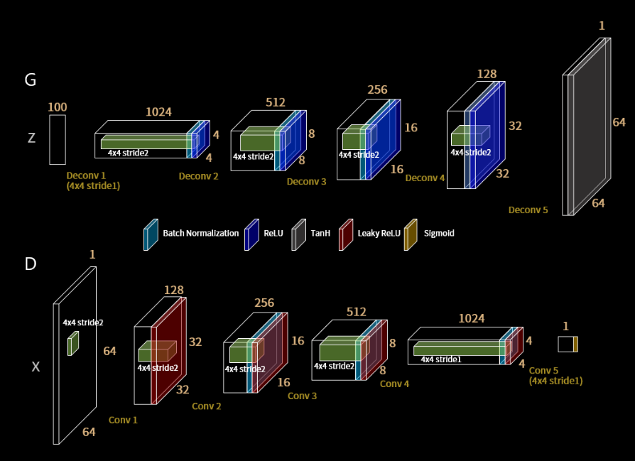

# DCGAN with pytorch

Generate hand written digit with pytorch

## Introduction

Some of the generative work done in the past year or two using generative adversarial networks (GANs) has been pretty exciting and 
demonstrated some very impressive results.  The general idea is that you train two models, one (G) to generate some sort of output example 
given random noise as input, and one (A) to discern generated model examples from real examples.  Then, by training A to be an effective 
discriminator, we can stack G and A to form our GAN, freeze the weights in the adversarial part of the network, and train the generative network 
weights to push random noisy inputs towards the “real” example class output of the adversarial half.  
  
The architecture of the neural network model is shown below.  
  

## Methodology

1. Prepare data (resize, crop, normalization)
2. Define a generator G and a discriminator D
3. Train the discriminator network with some real images and some fake images generated from random noise
4. Train the generator with random noise and real label
5. Save generated images and the models

## Result
Approximate training time: 1 hour  
Fake images:  
  
Real images:  
   

## References:
https://github.com/znxlwm/pytorch-MNIST-CelebA-GAN-DCGAN  
https://github.com/pytorch/examples/tree/master/dcgan  
https://www.kdnuggets.com/2016/07/mnist-generative-adversarial-model-keras.html  
